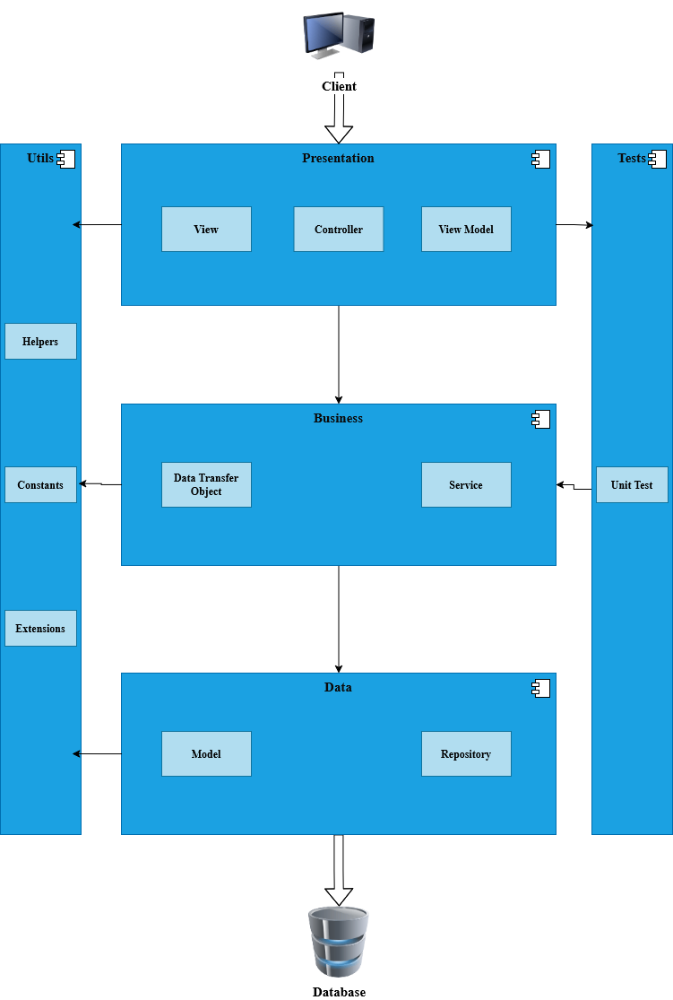

# CoreSocial – A Social Media Platform

A social media platform built with ASP.NET Core.

## 🔎 Overview

CoreSocial is a social networking application developed to consolidate and apply the knowledge gained through academic study and independent learning.

The platform allows users to register and authenticate, create and manage posts, interact through comments, and build connections via a friendship system. Posts can include multiple fields such as title, content, and an optional image. Users can search and sort posts by criteria such as title, popularity, or topic.

Registered users can:

- Create, edit, and delete their own posts and comments 
- Like or dislike comments 
- Send and receive friendship requests 
- Upload a profile avatar  
- View personalized profile pages (with contextual behavior when viewing their own vs. other users’ profiles)
    
The application supports three roles:

- User
- Moderator 
- Administrator

*This project is currently a work in progress (WIP)*

## 🛠 Tech Stack

- ASP.NET Core 5.0  
    - Entity Framework Core     
    - Identity Core      
- MVC (Razor Pages)   
- SQL Server
- xUnit (Unit Testing)
- jQuery
- Bootstrap

**Additional technologies:**

- AutoMapper
- Serilog

## 🏗 Architecture

### Diagram

  

  <i>Diagram illustrating the dependencies between each layer of the application.</i>

CoreSocial follows a layered (n-tier) architecture while remaining a monolithic application under a single solution. The solution is composed of five projects, three of which represent the primary architectural layers:

### Main Layers

- Presentation Layer
- Business Layer
- Data Layer
    
### Presentation Layer

The entry point of the application. It contains:

- Controllers (handling HTTP requests and responses)  
- Views and ViewModels 
- UI-related validation and presentation logic

### Business Layer

Contains both **Domain Services** and **Application Services**.

- Domain services encapsulate business logic related to specific entities.
- Application services orchestrate domain services to execute complete workflows.

This layer also contains the Data Transfer Objects (DTOs) used to pass structured data between layers.

### Data Layer

Responsible for persistence and infrastructure concerns. It contains:

- Domain entities
- DbContext
- Repository implementations and interfaces
- Migration files
- Domain-related enums
- File storage handling logic

### Supporting Projects

- **Utils** -
    Contains shared constants, helpers, extensions, and other reusable utilities.
- **Tests** -
    Contains unit tests focused on validating business logic behavior. Testing is performed using xUnit, Moq, and FluentAssertions.

### Patterns

- **Unit of Work** -
    Used to manage transactions across aggregated services.
- **Generic Repository** -
    Provides common CRUD functionality and abstracts database access.

## ✨ Features

- User authentication and role management (via Identity Core)   
- CRUD functionality for Posts and Comments
- Post search and sorting capabilities
- Friendship management system
- Object mapping across layers (ViewModels ↔ DTOs ↔ Entities)
- File storage handling with validation:
    - MIME type validation    
    - Regex-based filename validation    
    - File signature verification     
- Diagnostic logging (Serilog) 
- Global exception handling
- Unit testing of domain services
- UI feedback mechanisms:
    - Popups    
    - Validation messages     
    - Error pages

## 📷 Screenshots

*(Screenshots will be added in the future)*

## 📌 Roadmap

### 🐞 Bug Fixes
- [ ] Fix post creation edge cases
- [ ] Improve avatar upload handling
- [ ] Resolve UI popup rendering inconsistencies

### 🧩 New Features
- [ ] Add user warning / banning functionality
- [ ] Add administrative user analytics features

### ☁ Deployment
- [ ] Deploy the application to the cloud

## 📖 References

### Documentation

- [Traditional "N-Layer" architecture applications](https://learn.microsoft.com/en-us/dotnet/architecture/modern-web-apps-azure/common-web-application-architectures#traditional-n-layer-architecture-applications)
- [Implement a Generic Repository and a Unit of Work Class](https://learn.microsoft.com/en-us/aspnet/mvc/overview/older-versions/getting-started-with-ef-5-using-mvc-4/implementing-the-repository-and-unit-of-work-patterns-in-an-asp-net-mvc-application#implement-a-generic-repository-and-a-unit-of-work-class)

### Articles & Blogs

- [Code First Approach vs. Database First Approach: Which Is Best?](https://builtin.com/articles/code-first-vs-database-first-approach)
- [What is N-Tier Architecture?](https://stackify.com/n-tier-architecture/)
- [N-Tier Architecture Style: Definition and Advantages](https://www.indeed.com/career-advice/career-development/n-tier-architecture)
- [Data Transfer Object](https://martinfowler.com/eaaCatalog/dataTransferObject.html)
- [Defensive Programming](https://deviq.com/practices/defensive-programming)
- [Guard Clause](https://deviq.com/design-patterns/guard-clause)

## 🙏 Acknowledgments

Parts of the UI design were adapted from Bootdey templates:
- [User profile with friends and chat](https://www.bootdey.com/snippets/view/User-profile-with-friends-and-chat)
- [Bs4 edit profile page](https://www.bootdey.com/snippets/view/bs4-edit-profile-page)

## 📄 License

This project is licensed under the MIT License.